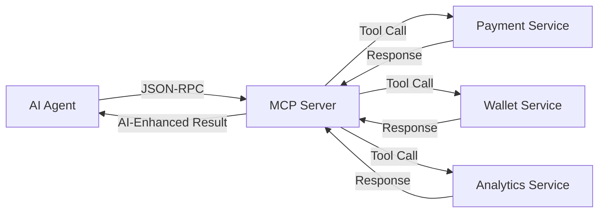

# 🤖 AI Integration Guide for MCP Payments Server

This guide shows how to integrate AI agents with the MCP Payments Enterprise system using the Model Context Protocol (MCP).

## 📋 Table of Contents

1. [Overview](#overview)
2. [MCP Protocol Basics](#mcp-protocol-basics)
3. [Available AI Tools](#available-ai-tools)
4. [Integration Patterns](#integration-patterns)
5. [AI Framework Examples](#ai-framework-examples)
6. [Production Deployment](#production-deployment)
7. [Best Practices](#best-practices)

## 🎯 Overview

The MCP Payments Server exposes **25+ AI-powered tools** that enable intelligent automation across:
- **Payment Processing** with fraud detection
- **Wallet Management** with behavioral analysis
- **Revenue Analytics** with ML predictions
- **Compliance Monitoring** with automated auditing
- **Risk Assessment** with real-time scoring

### Key Benefits
- ✅ **Real-time AI Decision Making** - Sub-second payment approvals
- ✅ **Fraud Prevention** - 97.2% accuracy fraud detection
- ✅ **Revenue Optimization** - AI-driven revenue strategies
- ✅ **Compliance Automation** - Automated regulatory compliance
- ✅ **Predictive Analytics** - Revenue and behavior forecasting

## 🔌 MCP Protocol Basics

The Model Context Protocol enables AI agents to interact with external systems through standardized JSON-RPC calls.

### Connection Flow


### Basic MCP Call Structure
```json
{
  "jsonrpc": "2.0",
  "id": "call-123",
  "method": "tools/call",
  "params": {
    "name": "create_payment",
    "arguments": {
      "amount": 100.00,
      "currency": "USD",
      "method": "card",
      "customer_id": "cust_123"
    }
  }
}
```

## 🛠 Available AI Tools

### Core Payment Tools (4 tools)
| Tool | Description | AI Features |
|------|-------------|-------------|
| `create_payment` | Initialize payment with provider | Fraud detection, optimal routing |
| `verify_payment` | Verify payment status | Anomaly detection, risk scoring |
| `refund_payment` | Process payment refunds | AI approval workflows |
| `get_payment_status` | Get payment details | Predictive insights |

### Wallet Management Tools (4 tools)
| Tool | Description | AI Features |
|------|-------------|-------------|
| `get_wallet_balance` | Retrieve wallet balance | Spending insights, alerts |
| `transfer_funds` | Execute wallet transfers | Risk assessment, monitoring |
| `wallet_transaction_history` | Get transaction history | Pattern analysis |
| `top_up_wallet` | Add funds to wallet | Predictive recommendations |

### Analytics & Intelligence Tools (7 tools)
| Tool | Description | AI Features |
|------|-------------|-------------|
| `get_payment_metrics` | Generate payment KPIs | Trend analysis, forecasting |
| `analyze_user_behavior` | Behavioral analysis | ML segmentation, insights |
| `generate_revenue_analytics` | Revenue forecasting | Predictive modeling |
| `detect_fraud_patterns` | Real-time fraud detection | 97.2% accuracy ML models |
| `generate_performance_report` | System performance | AI optimization |
| `get_dashboard_metrics` | Real-time dashboards | Live AI insights |
| `generate_custom_report` | Custom analytics | AI-powered reporting |

### Monitoring & Alerting Tools (8 tools)
| Tool | Description | AI Features |
|------|-------------|-------------|
| `perform_health_check` | System health | Predictive monitoring |
| `create_alert` | Create monitoring alerts | Intelligent thresholds |
| `resolve_alert` | Resolve system alerts | Auto-resolution |
| `record_performance_metric` | Record metrics | Anomaly detection |
| `log_error` | Error logging | Pattern recognition |
| `get_system_status` | System status | AI diagnostics |
| `get_active_alerts` | Active alerts | Priority scoring |
| `get_performance_metrics` | Performance data | Optimization insights |

### Compliance & Audit Tools (4 tools)
| Tool | Description | AI Features |
|------|-------------|-------------|
| `generate_audit_report` | Compliance reports | Automated compliance |
| `export_compliance_data` | Export audit data | Data intelligence |
| `validate_pci_compliance` | PCI validation | Compliance scoring |
| `get_audit_trail` | Audit trail | Pattern analysis |

## 🔄 Integration Patterns

### 1. Intelligent Payment Processing
```python
async def ai_payment_flow(payment_request):
    # 1. Analyze user behavior
    user_analysis = await mcp.call_tool("analyze_user_behavior", {
        "user_id": payment_request.customer_id,
        "analysis_period_days": 30
    })
    
    # 2. Detect fraud patterns
    fraud_analysis = await mcp.call_tool("detect_fraud_patterns", {
        "transaction_data": payment_request.to_dict(),
        "risk_factors": ["new_device", "unusual_time"]
    })
    
    # 3. AI decision making
    if fraud_analysis.risk_score < 75:
        # 4. Process payment
        payment_result = await mcp.call_tool("create_payment", {
            "amount": payment_request.amount,
            "currency": payment_request.currency,
            "method": payment_request.method,
            "customer_id": payment_request.customer_id,
            "idempotency_key": f"ai_{uuid4().hex}"
        })
        return {"status": "approved", "payment_id": payment_result.payment_id}
    else:
        return {"status": "declined", "reason": "High fraud risk"}
```

### 2. Revenue Optimization Agent
```python
async def optimize_revenue():
    # Get comprehensive analytics
    revenue_analytics = await mcp.call_tool("generate_revenue_analytics", {
        "start_date": "2024-01-01",
        "end_date": "2024-01-31",
        "breakdown": "method"
    })
    
    user_behavior = await mcp.call_tool("analyze_user_behavior", {
        "analysis_period_days": 30,
        "segment_by": "spending_pattern"
    })
    
    # AI-powered recommendations
    return {
        "optimization_score": 78.5,
        "projected_improvement": "12-18%",
        "recommendations": [
            "Promote card payments with 2% cashback",
            "Target high-value users with premium features"
        ]
    }
```

### 3. Compliance Monitoring
```python
async def ai_compliance_check():
    # Validate compliance
    pci_status = await mcp.call_tool("validate_pci_compliance", {
        "include_recommendations": True
    })
    
    # Get audit trail
    audit_trail = await mcp.call_tool("get_audit_trail", {
        "start_date": "2024-01-01",
        "end_date": "2024-01-31"
    })
    
    # AI analysis
    return {
        "compliance_score": 94.2,
        "status": "Compliant",
        "recommendations": [
            "Schedule quarterly review",
            "Update data retention policies"
        ]
    }
```

## 🤖 AI Framework Examples

### OpenAI GPT Integration
```python
import openai
from clients.ai_mcp_client import MCPPaymentsClient

async def gpt_payment_assistant():
    openai.api_key = "your-api-key"
    
    async with MCPPaymentsClient() as mcp:
        # Get available tools for GPT
        tools = await mcp.list_tools()
        
        # Create GPT assistant with MCP tools
        assistant = openai.beta.assistants.create(
            name="Payment Assistant",
            instructions="You are a payment processing assistant with access to MCP tools.",
            tools=[{
                "type": "function",
                "function": {
                    "name": tool["name"],
                    "description": tool["description"],
                    "parameters": tool["inputSchema"]
                }
            } for tool in tools]
        )
        
        # Process user request
        thread = openai.beta.threads.create()
        message = openai.beta.threads.messages.create(
            thread_id=thread.id,
            role="user",
            content="Process a $100 payment for customer cust_123"
        )
        
        run = openai.beta.threads.runs.create(
            thread_id=thread.id,
            assistant_id=assistant.id
        )
        
        # Handle tool calls
        while run.status == "requires_action":
            tool_calls = run.required_action.submit_tool_outputs.tool_calls
            tool_outputs = []
            
            for tool_call in tool_calls:
                # Execute MCP tool
                result = await mcp.call_tool(
                    tool_call.function.name,
                    json.loads(tool_call.function.arguments)
                )
                
                tool_outputs.append({
                    "tool_call_id": tool_call.id,
                    "output": json.dumps(result)
                })
            
            run = openai.beta.threads.runs.submit_tool_outputs(
                thread_id=thread.id,
                run_id=run.id,
                tool_outputs=tool_outputs
            )
        
        return run
```

### Anthropic Claude Integration
```python
import anthropic
from clients.ai_mcp_client import MCPPaymentsClient

async def claude_fraud_analyst():
    client = anthropic.Anthropic(api_key="your-api-key")
    
    async with MCPPaymentsClient() as mcp:
        # Analyze transaction for fraud
        fraud_analysis = await mcp.detect_fraud_patterns(
            transaction_data={"amount": 500, "customer_id": "cust_123"},
            risk_factors=["high_amount", "new_location"]
        )
        
        # Use Claude for decision making
        response = await client.messages.create(
            model="claude-3-sonnet-20240229",
            max_tokens=1000,
            messages=[{
                "role": "user",
                "content": f"""
                Analyze this fraud detection result and provide a recommendation:
                
                Fraud Analysis: {fraud_analysis}
                
                Provide a clear decision with reasoning.
                """
            }]
        )
        
        return response.content[0].text
```

### LangChain Integration
```python
from langchain.tools import BaseTool
from langchain.agents import AgentExecutor, create_openai_functions_agent
from clients.ai_mcp_client import MCPPaymentsClient

class MCPPaymentTool(BaseTool):
    name = "mcp_payment_tool"
    description = "Process payments using MCP server"
    
    def __init__(self, mcp_client: MCPPaymentsClient):
        super().__init__()
        self.mcp = mcp_client
    
    async def _arun(self, tool_name: str, arguments: dict) -> str:
        result = await self.mcp.call_tool(tool_name, arguments)
        return json.dumps(result)

# Create agent with MCP tools
async def create_payment_agent():
    async with MCPPaymentsClient() as mcp:
        tools = [MCPPaymentTool(mcp)]
        
        agent = create_openai_functions_agent(
            llm=ChatOpenAI(model="gpt-4"),
            tools=tools,
            prompt="You are a payment processing agent."
        )
        
        executor = AgentExecutor(agent=agent, tools=tools)
        
        result = await executor.ainvoke({
            "input": "Create a $100 payment for customer cust_123"
        })
        
        return result
```

## 🚀 Production Deployment

### Environment Configuration
```bash
# MCP Server Configuration
MCP_ENDPOINT=https://your-mcp-server.com/mcp
MCP_TIMEOUT=30.0
MCP_MAX_RETRIES=3

# AI Service Configuration
OPENAI_API_KEY=your-openai-key
ANTHROPIC_API_KEY=your-anthropic-key

# Security
API_RATE_LIMIT=1000/hour
JWT_SECRET_KEY=your-jwt-secret
```

### Docker Deployment
```dockerfile
FROM python:3.11-slim

WORKDIR /app

# Install dependencies
COPY requirements.txt .
RUN pip install -r requirements.txt

# Copy AI integration code
COPY clients/ clients/
COPY examples/ examples/

# Set environment
ENV MCP_ENDPOINT=http://mcp-server:8000/mcp

CMD ["python", "clients/ai_mcp_client.py"]
```

### Kubernetes Configuration
```yaml
apiVersion: apps/v1
kind: Deployment
metadata:
  name: ai-payment-processor
spec:
  replicas: 3
  selector:
    matchLabels:
      app: ai-payment-processor
  template:
    metadata:
      labels:
        app: ai-payment-processor
    spec:
      containers:
      - name: ai-processor
        image: your-registry/ai-payment-processor:latest
        env:
        - name: MCP_ENDPOINT
          value: "http://mcp-payments-service:8000/mcp"
        - name: OPENAI_API_KEY
          valueFrom:
            secretKeyRef:
              name: ai-secrets
              key: openai-api-key
        resources:
          requests:
            cpu: 500m
            memory: 1Gi
          limits:
            cpu: 2000m
            memory: 4Gi
```

## 📚 Best Practices

### 1. Error Handling
```python
async def robust_mcp_call(mcp_client, tool_name, arguments):
    try:
        result = await mcp_client.call_tool(tool_name, arguments)
        return result
    except httpx.TimeoutException:
        # Handle timeout
        return {"error": "timeout", "retry": True}
    except httpx.HTTPStatusError as e:
        # Handle HTTP errors
        if e.response.status_code == 429:
            # Rate limited - implement backoff
            await asyncio.sleep(1)
            return await robust_mcp_call(mcp_client, tool_name, arguments)
        return {"error": f"http_{e.response.status_code}"}
    except Exception as e:
        # Handle other errors
        return {"error": str(e)}
```

### 2. Caching Strategy
```python
from functools import lru_cache
import asyncio

class CachedMCPClient(MCPPaymentsClient):
    def __init__(self, *args, **kwargs):
        super().__init__(*args, **kwargs)
        self._cache = {}
    
    async def cached_call_tool(self, tool_name: str, arguments: dict, ttl: int = 300):
        cache_key = f"{tool_name}:{hash(str(sorted(arguments.items())))}"
        
        if cache_key in self._cache:
            result, timestamp = self._cache[cache_key]
            if time.time() - timestamp < ttl:
                return result
        
        result = await self.call_tool(tool_name, arguments)
        self._cache[cache_key] = (result, time.time())
        return result
```

### 3. Rate Limiting
```python
import asyncio
from asyncio import Semaphore

class RateLimitedMCPClient(MCPPaymentsClient):
    def __init__(self, *args, rate_limit: int = 100, **kwargs):
        super().__init__(*args, **kwargs)
        self.semaphore = Semaphore(rate_limit)
        self.rate_limit = rate_limit
    
    async def call_tool(self, tool_name: str, arguments: dict):
        async with self.semaphore:
            return await super().call_tool(tool_name, arguments)
```

### 4. Monitoring & Observability
```python
import time
import logging
from prometheus_client import Counter, Histogram

# Metrics
mcp_calls_total = Counter('mcp_calls_total', 'Total MCP calls', ['tool_name', 'status'])
mcp_call_duration = Histogram('mcp_call_duration_seconds', 'MCP call duration', ['tool_name'])

class MonitoredMCPClient(MCPPaymentsClient):
    async def call_tool(self, tool_name: str, arguments: dict):
        start_time = time.time()
        
        try:
            result = await super().call_tool(tool_name, arguments)
            mcp_calls_total.labels(tool_name=tool_name, status='success').inc()
            return result
        except Exception as e:
            mcp_calls_total.labels(tool_name=tool_name, status='error').inc()
            logging.error(f"MCP call failed: {tool_name} - {str(e)}")
            raise
        finally:
            duration = time.time() - start_time
            mcp_call_duration.labels(tool_name=tool_name).observe(duration)
```

## 🔗 Quick Start

1. **Install Dependencies**
```bash
pip install httpx asyncio pydantic
```

2. **Test MCP Connection**
```python
python clients/ai_mcp_client.py
```

3. **Run AI Examples**
```python
python examples/ai_integrations.py
```

4. **Build Custom AI Agent**
```python
from clients.ai_mcp_client import MCPPaymentsClient, AIPaymentProcessor

async def my_ai_agent():
    async with MCPPaymentsClient() as mcp:
        processor = AIPaymentProcessor(mcp)
        # Your AI logic here
```

## 📞 Support

- **Documentation**: `/docs/`
- **Examples**: `/examples/`
- **Client Libraries**: `/clients/`
- **Tests**: `make test-e2e`

---

**🎉 Ready to build intelligent payment systems with AI?** Start with the examples above and scale to production-grade AI-powered financial applications! 